<h1 align="center">👨‍💻 Victor Hugo Sousa Oliveira</h1>

  

Olá! Me chamo **Victor Hugo Sousa Oliveira**, tenho 25 anos, nasci em **Paulo Afonso - BA** e atualmente moro em **Canindé de São Francisco - SE**.

Estou no 6º período do curso de **Sistemas de Informação** na **UNIRIOS**, e sou apaixonado por tecnologia e programação, sempre buscando aprender e evoluir como desenvolvedor. Atualmente buscando minha primeira oportunidade de estágio na área.

  

## 🚀 Linguagens e Tecnologias

  

## 📌 Projeto em destaque

  

## 📊 Estatísticas do GitHub

  
  

  

  

---

📫 Me encontre em: <a href="https://github.com/ViktorHSO">GitHub</a>

